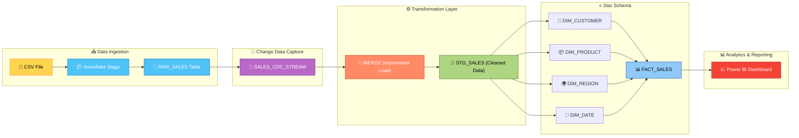

<p align="center">
  
</p>

### End-to-End Data Engineering Project: Incremental Loading, CDC, Star Schema & Power BI

<p align="center">
  
  
  
</p>

---

## 🔥 Project Snapshot

This project demonstrates a **production-grade retail data pipeline** built entirely with modern data stack principles using **Snowflake, SQL, and Power BI**. 

It simulates how modern data engineering teams handle:
- Continuous data ingestion from flat files  
- Change Data Capture (CDC) to track row-level modifications  
- Incremental processing (Upserts) for cost optimization  
- Dimensional Data Modeling (Star Schema) for analytics  
- Business Intelligence reporting  

> ⚡ **From raw CSV → Automated Pipeline → BI Dashboard**

---

## 🧠 Business Use Case

A retail enterprise receives daily sales data from multiple POS (Point of Sale) systems. 
To make agile decisions, the business requires:
- Reliable ingestion of raw, untyped data.
- Efficient processing of *only* changed data (avoiding expensive full-table reloads).
- An optimized, read-heavy schema for reporting.
- Automated dashboards for tracking KPIs like total revenue, regional performance, and product profitability.

---

## 🖼️ Architecture & Visual Workflow


---

## 🛠️ Tech Stack

| Component       | Technology        | Purpose                          |
| --------------- | ----------------- | -------------------------------- |
| Data Warehouse  | Snowflake         | Storage, compute, processing     |
| Transformation  | SQL               | Data cleaning and transformation |
| Orchestration   | Snowflake Tasks   | Pipeline automation              |
| CDC             | Snowflake Streams | Change tracking                  |
| Visualization   | Power BI          | Dashboards                       |
| Version Control | GitHub            | Code management                  |

---

## 📂 Project Structure

```
retail-data-pipeline/
│
├── 📁 data/
│   └── retail_sales_raw.csv          # Sample dataset (30 orders)
│   └── retail_sales_Dataset.csv      # Kaggle dataset
├── 📁 sql/
│   ├── 01_setup/
│   │   └── 01_snowflake_environment_setup.sql   # DB, schema, warehouse, roles
│   │
│   ├── 02_raw_layer/
│   │   └── 01_raw_table_and_stage.sql           # Raw table, stage, COPY INTO
│   │
│   ├── 03_transformation/
│   │   └── 01_transform_sales.sql               # Cleaning, typing, derived columns
│   │
│   ├── 04_cdc_streams/
│   │   └── 01_cdc_stream_setup.sql              # Snowflake Stream for CDC
│   │
│   ├── 05_merge_incremental/
│   │   └── 01_incremental_merge.sql             # MERGE statement (upsert)
│   │
│   ├── 06_tasks/
│   │   └── 01_pipeline_tasks.sql                # Automated scheduling
│   │
│   ├── 07_star_schema/
│   │   └── 01_star_schema_design.sql            # Fact + 4 Dimension tables
│   │
│   ├── 08_analytical_queries/
│   │   └── 01_business_analytics.sql            # BI-ready SQL queries
│   │
│   └── 09_data_quality/
│       └── 01_data_quality_and_bonus.sql        # DQ checks, Time Travel, optimization
│
├── 📁 powerbi/
│   └── POWERBI_INTEGRATION.md                   # Step-by-step Power BI guide
│
├── 📁 images/
│   └──screenshot_1.png
│
├── 📁 docs/
│   └── Project Documentation
│
└── README.md                                    # This file
```
---

## ✨ Key Features

| Feature                    | Description                                 |
| -------------------------- | ------------------------------------------- |
| 🔄 **Incremental Loading** | Uses MERGE to process only new/changed data |
| 📡 **CDC with Streams**    | Tracks INSERT, UPDATE, DELETE automatically |
| ⚙️ **Task Automation**     | Scheduled pipelines using Snowflake Tasks   |
| ⭐ **Star Schema**          | Optimized dimensional model for analytics   |
| 🧪 **Data Quality**        | Automated validation checks with logging    |
| ⏱️ **Time Travel**         | Access historical data for recovery         |
| 📊 **Power BI Ready**      | DirectQuery + pre-built DAX measures        |

---
## 🎯 Key Highlights

- Built an end-to-end data pipeline using Snowflake  
- Implemented CDC with Streams and incremental loading  
- Designed a scalable Star Schema for analytics  
- Automated workflows using Snowflake Tasks  
- Integrated Power BI for business reporting
- 
---

## 📊 Dataset

The project uses a realistic retail sales dataset with 30 orders across 5 months (Jan–May 2024):

| Column | Type | Description |
|--------|------|-------------|
| `order_id` | VARCHAR | Unique order identifier |
| `order_date` | DATE | Date the order was placed |
| `customer_id` | VARCHAR | Customer identifier |
| `customer_name` | VARCHAR | Full name of the customer |
| `product` | VARCHAR | Product name |
| `category` | VARCHAR | Product category (Electronics, Furniture, etc.) |
| `region` | VARCHAR | Sales region (North/South/East/West) |
| `sales` | FLOAT | Total sales amount (USD) |
| `quantity` | INT | Units sold |
| `profit` | FLOAT | Profit on the order (USD) |

---

## 🔑 Core Concepts

### 📡 1. Change Data Capture (CDC)
- Snowflake Streams track row-level changes automatically
- Captures:
  - INSERT → new records
  - UPDATE → DELETE + INSERT pair
  - DELETE → removed records
- Enables efficient incremental processing

---

### 🔄 2. Incremental Loading (MERGE)
- Avoids full table reloads
- Processes only changed data

```sql
MERGE INTO stg_sales t
USING sales_cdc_stream s
ON t.order_id = s.order_id

WHEN MATCHED AND s.metadata$action = 'INSERT' THEN UPDATE
WHEN MATCHED AND s.metadata$action = 'DELETE' THEN DELETE
WHEN NOT MATCHED AND s.metadata$action = 'INSERT' THEN INSERT
```
### ⭐ 3. Star Schema (Dimensional Modeling)

- **FACT_SALES** — one row per order transaction with measures (sales, profit)  
- **DIM_CUSTOMER** — customer attributes + segmentation  
- **DIM_PRODUCT** — product name + category  
- **DIM_REGION** — region lookup table  
- **DIM_DATE** — calendar table with year/month/quarter attributes  

#### 💡 Why Star Schema?
- Faster query performance  
- Simplified joins  
- Optimized for BI tools like Power BI
  
---

**Skills demonstrated:** Snowflake · SQL · ETL · CDC · Star Schema · Dimensional Modeling · Power BI · Pipeline Automation

## 🚀 Getting Started

### Prerequisites
- Snowflake Account
- Power BI Desktop
- SnowSQL / Web UI

### Steps
```markdown
1. Clone the repository  
```bash
git clone https://github.com/shivareddy2002/retail-data-pipeline.git
2. Run SQL scripts in order (01 → 09)
3. Upload dataset to Snowflake Stage
4. Execute pipeline tasks
5. Connect Power BI to Snowflake
```
--- 

## 🔭 Future Scope

- Implement **Snowpipe** for real-time, event-driven ingestion from AWS S3 / Azure Blob Storage  
- Integrate **dbt (Data Build Tool)** for modular and testable data models  
- Use **Apache Airflow** for scalable pipeline orchestration

---

## 👨‍💻 Author  

**Lomada Siva Gangi Reddy**  
- 🎓 B.Tech CSE (Data Science), RGMCET (2021–2025)  
- 💡 Interests: Python | Machine Learning | Deep Learning | Data Science  
- 📍 Open to **Internships & Job Offers**

 **Contact Me**:  

- 📧 **Email**: lomadasivagangireddy3@gmail.com  
- 📞 **Phone**: 9346493592  
- 💼 [LinkedIn](https://www.linkedin.com/in/lomada-siva-gangi-reddy-a64197280/)  🌐 [GitHub](https://github.com/shivareddy2002)  🚀 [Portfolio](https://lsgr-portfolio-pulse.vercel.app/)

---
<p align="center">  </p>


# Retail Data Platform (Enterprise Medallion on Snowflake)

## Project Overview
This project upgrades a basic CSV-to-BI pipeline into an enterprise-ready **Bronze → Silver → Gold** data platform with CDC, incremental MERGE, SCD Type 2, DQ controls, monitoring, and Power BI reporting.

## Architecture (text diagram)
```text
CSV/API/Streaming Simulation
        │
        ▼
BRONZE (raw VARIANT + metadata)
        │
        ▼
STREAMS (CDC offsets)
        │
        ▼
SILVER (clean, typed, deduplicated, late-data aware MERGE)
        │
        ▼
GOLD (Star Schema + aggregates)
        │
        ├── Data Quality checks + quarantine
        ├── Monitoring logs + query performance
        └── Power BI dashboards
```

## Tools & Technologies
- Snowflake (DB, Streams, Tasks, Time Travel)
- SQL (ELT and dimensional modeling)
- Power BI (semantic model + dashboards)
- GitHub (versioned project structure)

## Folder Structure
```text
retail-data-platform/
├── data/
│   └── retail_sales_enterprise_sample.csv
├── sql/
│   ├── setup/
│   ├── bronze/
│   ├── streams/
│   ├── silver/
│   ├── gold/
│   ├── tasks/
│   ├── dq/
│   ├── monitoring/
│   ├── optimization/
│   └── analytics/
├── powerbi/
├── docs/
├── images/
└── README.md
```

## Step-by-Step Setup
1. Run `sql/setup/00_environment_setup.sql`.
2. Upload `data/retail_sales_enterprise_sample.csv` to `@BRONZE.STG_RETAIL_CSV`.
3. Run `sql/bronze/01_ingestion_and_bronze.sql`.
4. Run `sql/streams/01_cdc_streams.sql`.
5. Run `sql/silver/01_silver_transform_and_merge.sql`.
6. Run `sql/gold/01_star_schema_and_gold_marts.sql`.
7. Run DQ/monitoring/optimization scripts.
8. Run task DAG script and resume root task.
9. Connect Power BI using `powerbi/POWERBI_INTEGRATION.md`.

## Enterprise Features
- Medallion architecture (Bronze/Silver/Gold)
- Incremental CDC with Snowflake Streams
- SCD Type 2 in `DIM_CUSTOMER`
- Task DAG orchestration every 5 minutes
- Data Quality framework with quarantine
- Monitoring tables and query performance view
- Performance optimization (cluster keys, search optimization, MV)
- Time Travel ready for data recovery/audits

## Why Star Schema?
Star schema separates facts (measures) from dimensions (descriptive context), giving:
- Faster BI query performance with simpler joins
- Reusable conformed dimensions
- Easier business-friendly analytics modeling

## Analytical Queries Included
- Top products by revenue
- Region-wise performance
- Monthly trends
- Customer segmentation (RFM-lite)

## Screenshots (placeholders)
- `images/pipeline_overview.png`
- `images/powerbi_dashboard.png`

## Real-World Impact
This design mirrors production patterns used in enterprise retail:
- Minimizes cost via incremental loads
- Improves trust with DQ + quarantine
- Enables SLA-driven operations with task automation + monitoring
- Supports executive reporting in near real-time
